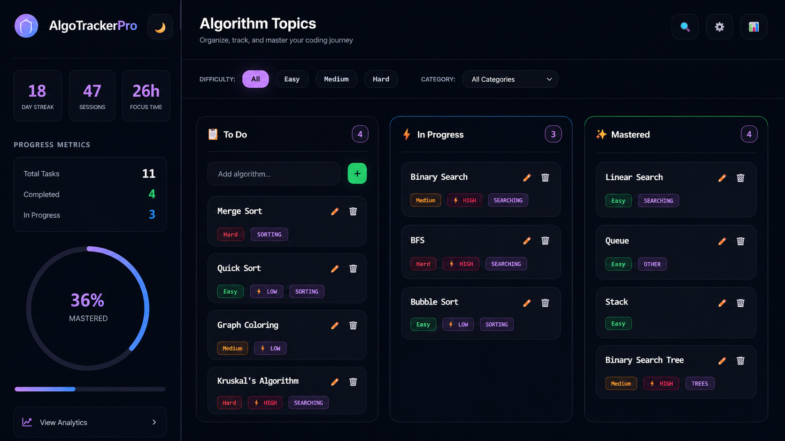
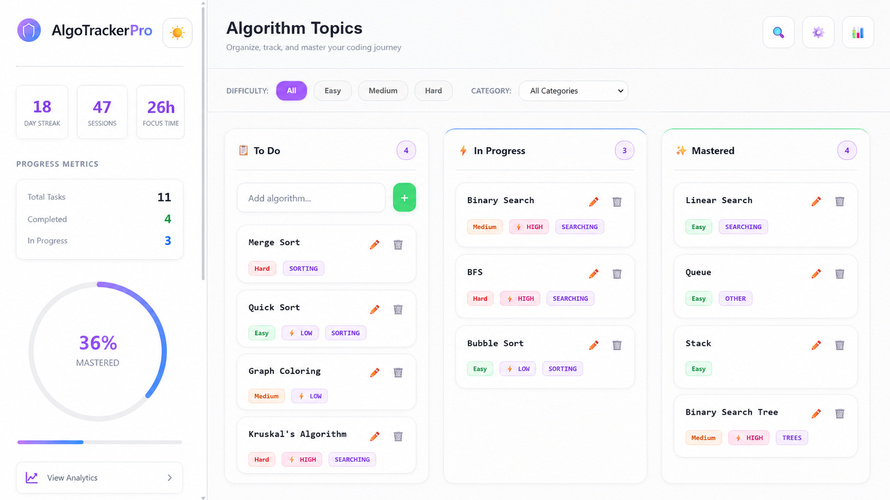
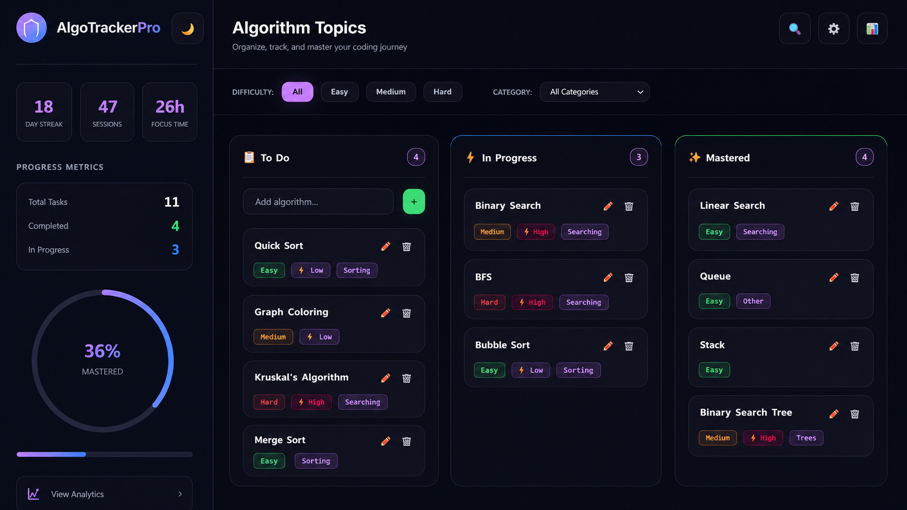
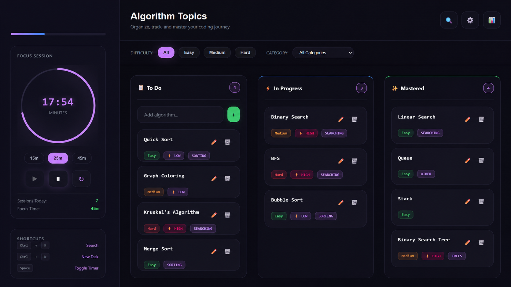
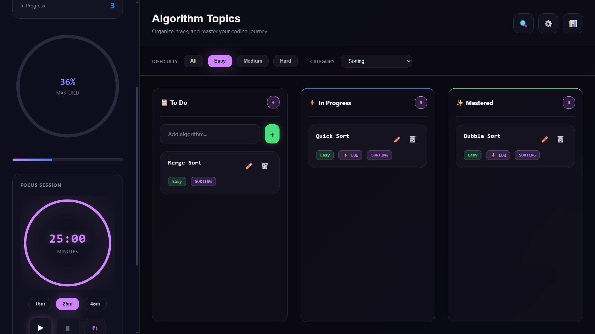
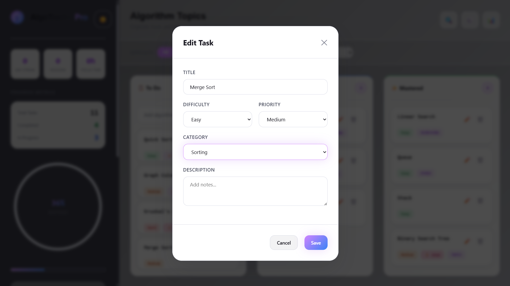

# 🚀 AlgoTracker Pro

A modern algorithm and DSA progress tracker built with **HTML, CSS, and JavaScript**.

Track your learning journey, organize topics, analyze your progress, and stay focused while mastering Data Structures & Algorithms.


---

## ✨ Features

- 📋 Kanban-style algorithm tracker
- 🌙 Dark & ☀️ Light theme
- 📊 Analytics dashboard
- 🎯 Focus Session (Pomodoro Timer)
- 🔍 Search & Category Filters
- 📈 Progress Metrics
- 📅 Day Streak Tracking
- 💾 Local Storage Persistence
- 📱 Responsive Design
- 🎨 Modern UI

---

## 📸 Screenshots

### Dashboard (Dark Theme)



### Dashboard (Light Theme)



### Analytics Dashboard



### Focus Session



### Search & Filters



### Add New Task



---

## 🛠️ Built With

- HTML5
- CSS3
- JavaScript (ES6)
- Local Storage API

---

## 📂 Project Structure

```
AlgoTracker/
│
├── screenshots/
│   ├── add-task.png
│   ├── analytics.png
│   ├── dashboard-dark.png
│   ├── dashboard-light.png
│   ├── focus-session.png
│   └── search-filter.png
│
├── index.html
├── styles.css
├── app.js
└── README.md
```

---

## 🚀 Getting Started

Clone the repository:

```bash
git clone https://github.com/harshraj-31/AlgoTracker-Pro.git
```

Open the project folder:

```bash
cd AlgoTracker-Pro
```

Launch `index.html` in your browser.

No installation or dependencies are required.

---

## 🎯 Roadmap

- ☁️ Cloud Sync
- 📈 Weekly Progress Reports
- 📝 Notes for Algorithms
- 📂 Export & Import Data
- 🏆 Achievement Badges
- 📱 Mobile-Friendly Improvements

---

## 👨‍💻 Author

**Harshrajsinh Zala**

GitHub: https://github.com/harshraj-31

---

## ⭐ Show Your Support

If you like this project, consider giving it a **⭐ Star** on GitHub.
